# Manual de Usuario - AttendCheck V1.0

## Índice

1. [Introducción](#introducción)  
2. [Consideraciones](#consideraciones)  
3. [Inscripción](#3-inscripción)  
    - 3.1 [Inscripción a un grupo](#31-inscripción-a-un-grupo)  
    - 3.2 [Inscripción campamento](#32-inscripción-a-campamento)  
    - 3.3 [Transferir estudiante](#33-transferir-estudiante)  
    - 3.4 [Cancelar Inscripción](#34-cancelar-inscripción)  
4. [Cuotas estudiante](#4-cuotas-estudiante)  
    - 4.1 [Cobrar cuota](#41-cobrar-cuota)  
    - 4.2 [Crear y Aplicar Descuentos](#42-crear-y-aplicar-descuentos)  
        - 4.2.1 [Crear un descuento](#421-crear-un-descuento)  
        - 4.2.2 [Aplicar un descuento](#422-aplicar-un-descuento)  
    - 4.3 [Generar cuota](#43-generar-cuota)  
5. [Becas](#5-becas)  
    - 5.1 [Otorgar beca](#51-otorgar-beca)  
6. [Factura](#6-factura)  
    - 6.1 [Crear factura](#61-crear-factura)  
    - 6.2 [Cobrar factura](#62-cobrar-factura)  
    - 6.3 [Anular factura](#63-anular-factura)  
7. [Inventario](#7-invetario)  
    - 7.1 [Crear articulo](#71-crear-articulo)  
    - 7.2 [Modificar precio articulo](#72-modificar-precio-articulo)  
    - 7.3 [Compras](#73-compras)  
8. [Eventos](#8-eventos)  
    - 8.1 [Crear evento pagado](#81-crear-evento-pagado)  
9. [Cargar datos en lote](#9-carga-masiva)  
    - 9.1 [Cargar lote de estudiantes](#91-cargar-lote-de-estudiantes)  
    - 9.2 [Cargar lote de artículos](#92-cargar-lote-de-artículos)  
10. [Soporte](#10-soporte)  

---

## Introducción

Este manual explica cómo utilizar **AttendCheck**.  

Esta aplicación está diseñada para facilitar la gestión operativa de academias de fútbol.  
Permite registrar y administrar las inscripciones de estudiantes, así como llevar un control eficiente del pase de lista en cada entrenamiento o actividad programada.

Además, incluye un módulo de inventario que permite gestionar la disponibilidad y venta de insumos como uniformes, generando facturas de forma automática para cada transacción.  
El objetivo es optimizar los procesos administrativos y ofrecer una herramienta integral para el seguimiento de estudiantes y recursos dentro de la academia.

### Información del documento

- **Versión:** 1.0.0  
- **Fecha:** 28 de junio de 2025  
- **Autor:** Equipo de desarrollo AttendChecks

---

## Consideraciones

- Antes de realizar cualquier operación, asegúrese de tener la sucursal correspondiente seleccionada. 

<!-- 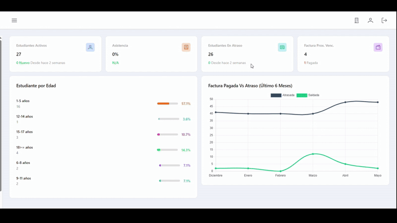 -->

--- 

## 3. Inscripción

### 3.1 Inscripción a un grupo

Para registrar a un estudiante en un grupo, siga los pasos detallados a continuación:

1. Acceda a la opción [Inscripción](https://app.attendchecks.com/process/inscripcion) ubicada en la sección de ***PROCESOS*** del menú lateral izquierdo.  

2. En el formulario que se despliega, seleccione el grupo en el que desea realizar la inscripción.

    > **Nota:** Una vez seleccionado el grupo, se mostrará una sección informativa con detalles relevantes, tales como la cantidad de estudiantes inscritos y el docente asignado.

3. A continuación, seleccione al estudiante que desea inscribir mediante el cuadro de diálogo emergente. Esta ventana permite filtrar estudiantes por nombre o apellido.

    > **Nota:** En caso de que el estudiante no se encuentre registrado en el sistema, podrá agregarlo haciendo clic en el botón verde situado junto al selector. Esto abrirá un formulario en el cual podrá ingresar los datos correspondientes. Una vez guardado, el estudiante aparecerá automáticamente preseleccionado en el formulario anterior.  
    > 
    > 

4. Finalmente, indique la fecha en la que la inscripción deberá hacerse efectiva y presione el botón **Guardar** para completar el proceso.

    > **Nota:** Tras guardar la inscripción, el sistema lo redirigirá automáticamente a la sección de cobros, donde podrá gestionar el pago correspondiente, si aplica.

Ejemplo:  

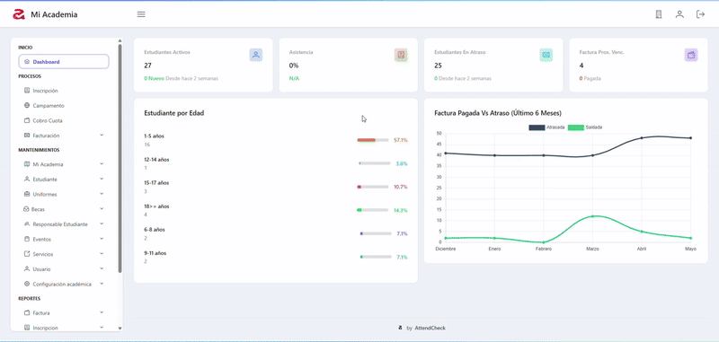

### 3.2 Inscripción a campamento

Para efectuar la inscripción de un estudiante a un campamento, siga los pasos detallados a continuación:

1. Acceda a la opción [Campamento](https://app.attendchecks.com/process/campamento), ubicada en la sección ***PROCESOS*** del menú lateral izquierdo.  
2. En el formulario que se despliega, seleccione el grupo en el que desea realizar la inscripción.

    > **Nota:** Una vez seleccionado el grupo, se mostrará una sección informativa con detalles relevantes, tales como la cantidad de estudiantes inscritos y el docente asignado.

3. A continuación, seleccione al estudiante que desea inscribir mediante el cuadro de diálogo emergente. Esta ventana permite filtrar estudiantes por nombre o apellido.

    > **Nota:** En caso de que el estudiante no se encuentre registrado en el sistema, podrá agregarlo haciendo clic en el botón verde situado junto al selector. Esto abrirá un formulario en el cual podrá ingresar los datos correspondientes. Una vez guardado, el estudiante aparecerá automáticamente preseleccionado en el formulario anterior.

4. Seleccione las semanas o periodos definidos en los que desea inscribir al estudiante.

    > **Nota:** En caso de requerirlo, es posible modificar la inscripción posteriormente en esta misma ventana para agregar semanas adicionales.

5. Finalmente, presione el botón **Guardar** para completar el proceso.

    > **Nota:** Tras guardar la inscripción, el sistema lo redirigirá automáticamente a la sección de cobros, donde podrá gestionar el pago correspondiente, si aplica.

Ejemplo:  

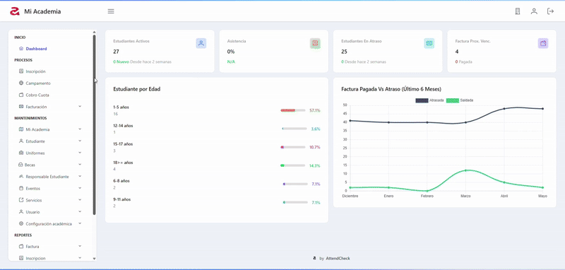

### 3.3 Transferir estudiante

Para transferir a un estudiante de un grupo a otro, siga los pasos detallados a continuación:

1. En el menú lateral izquierdo, acceda a la opción [Transferencia Grupo](https://app.attendchecks.com/estudiante/transferenciagrupo), ubicada en *`Mantenimiento > Estudiante > Transferencia Grupo`*.  

2. En el formulario que se muestra, seleccione primero el `Grupo Origen`, es decir, el grupo en el que actualmente se encuentra el estudiante que desea transferir.

3. Una vez seleccionado el grupo de origen, utilice el selector de estudiantes para buscar y seleccionar al estudiante correspondiente.

4. A continuación, seleccione el `Grupo Destino`, al cual será transferido el estudiante.

5. Por último, indique la fecha en la que la transferencia deberá hacerse efectiva y presione el botón **Guardar** para completar el proceso.

Ejemplo:  

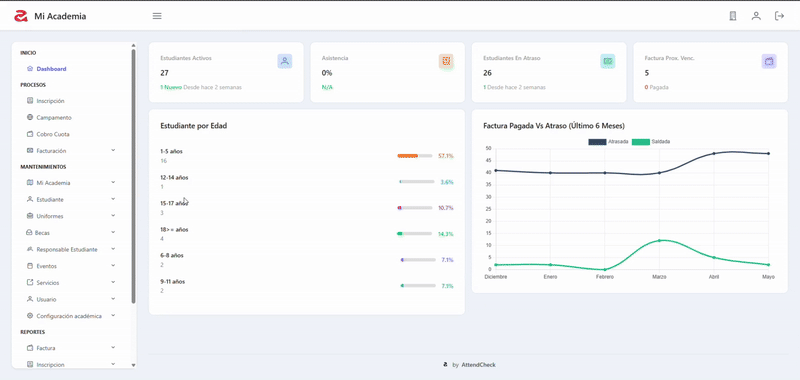

### 3.4 Cancelar inscripción

Para cancelar la inscripción de un estudiante, siga los pasos detallados a continuación:

1. En el menú lateral izquierdo, acceda a la opción [Cancelar Inscripción](https://app.attendchecks.com/estudiante/cancelarInscripcion), ubicada en *`Mantenimiento > Estudiante > Cancelar Inscripción`*.  

2. En el formulario que se muestra a continuación, utilice el selector de estudiantes para buscar y seleccionar al estudiante cuya inscripción desea cancelar.

3. Una vez seleccionado el estudiante, en el selector de grupos se mostrarán todos los grupos en los que se encuentra inscrito. Seleccione el grupo del cual desea removerlo.

4. Por último, presione el botón **Enviar** para completar el proceso.

Ejemplo:  

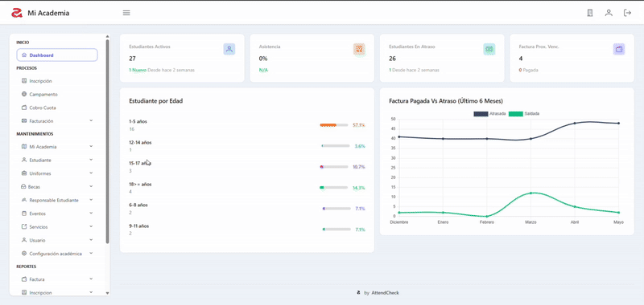

---

## 4. Cuotas estudiante  

### 4.1 Cobrar cuota

Para aplicar el pago de la cuota de un estudiante inscrito en un grupo, siga los pasos detallados a continuación:

1. Acceda a la opción [Cobro Cuota](https://app.attendchecks.com/process/factura), ubicada en *`Procesos > Cobro Cuota`*.

2. En la ventana de cobro, utilice el selector ubicado en la parte superior izquierda de la página para seleccionar al padre o estudiante al cual desea aplicar el pago.

    > **Nota:** Al seleccionar un padre, se visualizarán las cuotas de todos los estudiantes que estén vinculados a él.

3. Una vez seleccionado el estudiante, se mostrarán todas sus cuotas. Seleccione aquellas a las que desea aplicar el pago.

    > **Nota:** Podrá visualizar tanto las cuotas vencidas como las vigentes. Por defecto, el sistema obliga a pagar primero las cuotas más antiguas; por lo tanto, no será posible aplicar un pago a una cuota vigente si aún existen cuotas vencidas pendientes.

4. Después de seleccionar las cuotas, presione el botón **Aplicar Pago**, ubicado en la parte superior derecha de la página.

5. En el formulario emergente, complete los campos requeridos: seleccione el padre que realiza el pago (opcional), indique el medio de pago y, por último, introduzca el monto a aplicar.

6. Una vez completados todos los datos, presione el botón **Realizar Cobro** para finalizar la transacción.

7. Al concluir, el sistema le preguntará si desea imprimir el comprobante. En caso afirmativo, seleccione la opción *Sí*.

Ejemplo:  

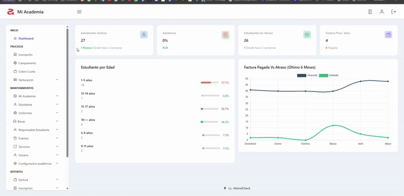

### 4.2 Crear y aplicar descuentos

#### 4.2.1 Crear un descuento

Para definir un nuevo descuento, siga los pasos detallados a continuación:

1. Acceda a la opción [Descuento](https://app.attendchecks.com/descuento/), ubicada en *`Mantenimientos > Configuración Academia > Descuento`*.

2. En la página que se muestra a continuación, presione el botón **Nuevo**, ubicado en la esquina superior izquierda.

3. Complete los datos del formulario ingresando una descripción para el descuento, el porcentaje a aplicar y, en caso de que este solo aplique a campamento, marque la casilla `[] Campamento`.

4. A continuación, defina las condiciones para aplicar el descuento. Para ello, haga clic en la pestaña **Condiciones** ubicada en la parte superior del formulario.

    > **Tips 4.2.1:** Una condición en un descuento es una regla que debe cumplirse en las cuotas del estudiante para que el descuento pueda ser aplicado. Existen cinco condiciones disponibles:
    >
    > - **Cantidad de cuotas máximas:** número máximo de cuotas a las que se puede aplicar el descuento.  
    > - **Cantidad de cuotas mínimas:** número mínimo de cuotas que debe pagar el estudiante para que el descuento sea válido.  
    > - **Estudiante interno:** determina si el descuento aplica solo a estudiantes con esta condición.  
    > - **Fecha máxima de período:** límite superior del período aplicable.  
    > - **Fecha mínima de período:** límite inferior del período aplicable.

5. Seleccione las condiciones que desee aplicar junto con sus respectivos valores. Una vez finalizado, presione el botón **Guardar** para completar el proceso.

Ejemplo:  

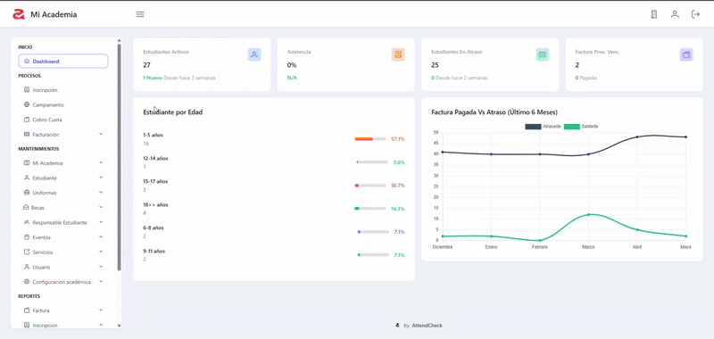

#### 4.2.2 Aplicar un descuento

Antes de aplicar un descuento, es importante conocer los descuentos vigentes en el sistema y las condiciones definidas para su aplicación. Para más detalles sobre las condiciones, consulte el apartado `Tip` del capítulo anterior.  

En este ejemplo, aplicaremos un descuento por pronto pago, el cual requiere como condiciones que el estudiante pague un mínimo de 2 cuotas y un máximo de 5. Para ello, siga los pasos a continuación:

1. Diríjase a la ventana de cobro de cuotas y seleccione al estudiante al que se le aplicarán los pagos.

2. En el listado, seleccione al menos 2 cuotas para poder aplicar el descuento por pronto pago.

3. En el formulario emergente, después de completar los datos del pago, se habilitará una nueva columna llamada `Descuentos disponibles`. Aquí podrá seleccionar `Ninguno` si no desea aplicar un descuento, o elegir el que corresponda. En este caso, seleccionamos un descuento del 10 % por pronto pago.

4. Tras seleccionar el descuento, podrá definir un porcentaje igual o inferior al establecido, según el tipo de descuento seleccionado.

    > **Nota:** Puede visualizar un resumen del descuento aplicado haciendo clic en el botón azul que aparece junto al campo `Monto Descuento`.

5. Finalmente, presione el botón **Realizar Cobro** para completar el proceso.

Ejemplo:  

### 4.3 Generar cuota

Para generar cuotas adicionales, siga los pasos detallados a continuación:

1. Acceda a la opción [Generar Cuotas](https://app.attendchecks.com/process/factura/generarCuota), ubicada en *`Procesos > Facturación > Generar Cuotas`*.

2. En el formulario que aparece a continuación, complete los campos solicitados. En el selector de estudiantes, busque y seleccione al estudiante al que desea generar las cuotas adicionales.

3. Una vez seleccionado el estudiante, indique la cantidad de cuotas que desea generar. El máximo permitido es de 12 cuotas.

4. Para finalizar, seleccione la fecha a partir de la cual se generarán las nuevas cuotas y presione el botón **Guardar** para completar el proceso.

Ejemplo:

--- 

## 5. Becas

### 5.1 Otorgar beca

Para otorgar una beca a un estudiante, siga los pasos detallados a continuación:

1. Acceda a la opción [Otorgar Beca Estudiante](https://app.attendchecks.com/beca/otorgarbeca), ubicada en *`Mantenimientos > Becas > Otorgar Beca Estudiante`*.

2. Complete los campos correspondientes en el formulario que se muestra. Primero, busque y seleccione al estudiante; luego, en el selector de grupos, elija el grupo en el que se encuentra inscrito. A continuación, seleccione la beca que desea aplicar y defina las fechas de inicio y finalización durante las cuales estará vigente.

3. Para finalizar, presione el botón **Guardar** para completar la transacción.

    > **Nota:** Una vez aplicada la beca, todas las facturas pendientes o vigentes a partir de la fecha indicada serán saldadas o se les aplicará el descuento automáticamente.

Ejemplo:

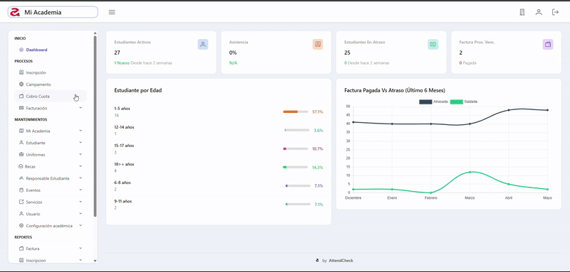

---

## 6. Factura  

### 6.1 Crear factura

Para crear una factura, siga los pasos detallados a continuación:

1. Acceda a la opción [Crear Factura](https://app.attendchecks.com/process/factura/generarFactura), ubicada en *`Procesos > Facturación > Nueva Factura`*.

2. Complete los datos en el formulario que aparece en la parte superior de la página. Primero, busque y seleccione al cliente o estudiante al que se le creará la factura. En caso de tratarse de un cliente no registrado en el sistema, puede marcar la casilla *Cliente No Registrado* e ingresar una descripción. Luego, indique el método de facturación y, si lo requiere, añada una nota u observación.

3. Para agregar un artículo a la factura, presione el botón **Agregar**, ubicado debajo del formulario. A continuación, se desplegará un menú en el que podrá indicar el tipo de producto que desea añadir (artículo, servicio o evento). En este caso, seleccionaremos un artículo.

4. En el formulario que se muestra, seleccione el artículo que desea agregar, luego elija el tamaño o presentación (si aplica) y, por último, la cantidad deseada. Finalmente, presione el botón **Guardar** para añadir el artículo a la factura.

    > **Nota:** Es posible editar o eliminar cada uno de los artículos agregados antes de enviar la factura. Para ello, haga clic en los íconos que aparecen al final de cada registro.

5. Una vez agregados todos los productos requeridos, presione el botón **Guardar**, ubicado en la parte superior del listado. A continuación, dependiendo del método de facturación seleccionado, se desplegará un último formulario en el cual deberá indicar el método de pago y el monto que se aplicará a la factura en ese momento. Finalmente, presione el botón **Aplicar** para completar el proceso.

Ejemplo:

 

### 6.2 Cobrar factura

Para cobrar una factura, siga los pasos detallados a continuación:

1. Acceda a la opción [Cobrar Factura](https://app.attendchecks.com/process/factura/realizarCobro), ubicada en *`Procesos > Facturación > Realizar Cobro`*.

2. En la parte superior de la ventana, seleccione al cliente o estudiante al que se le realizará el cobro.

3. Una vez seleccionado el cliente, se mostrarán todas las facturas pendientes registradas. Seleccione las facturas que desea cobrar y luego presione el botón **Aplicar Pago**.

4. En el formulario que se muestra a continuación, indique el medio de pago y el monto que desea aplicar a la factura.

5. Para finalizar, presione el botón **Aplicar** para completar el proceso.

Ejemplo:

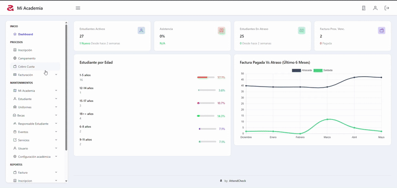  

### 6.3 Anular factura

Para anular una factura, siga los pasos detallados a continuación:

1. Acceda a la opción [Anular Factura](https://app.attendchecks.com/process/factura/anularfacturaestudiante), ubicada en *`Procesos > Facturación > Anular Factura`*.

2. En la parte superior de la ventana, seleccione al cliente o estudiante al que desea anular una o varias facturas.

3. Una vez seleccionado el cliente, se mostrarán todas las facturas registradas. Para anular una factura, seleccione el botón rojo que aparece al final de cada registro. A continuación, se mostrará un cuadro de diálogo donde deberá indicar el motivo de la cancelación.

4. Para finalizar, presione el botón **Guardar** para completar el proceso.

Ejemplo:

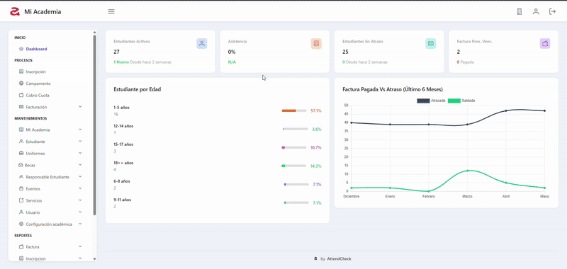

--- 

## 7. Inventario

### 7.1 Crear artículo

Para crear un nuevo artículo, siga los pasos detallados a continuación:

1. Acceda a la opción [Artículo](https://app.attendchecks.com/inventario/articulo), ubicada en *`Mantenimientos > Uniformes > Inventario > Artículo`*.

2. En la ventana que se muestra, presione el botón **Nuevo**, ubicado en la parte superior.

3. En el formulario que aparece a continuación, complete los datos solicitados. Primero, digite la descripción del artículo, luego seleccione una categoría y especifique si el artículo estará exento de ITBIS, marcando la casilla correspondiente en caso de aplicar.

4. Una vez completados los datos básicos del artículo, opcionalmente puede definir su precio. Para ello, haga clic en la pestaña *Precio Artículo*, ubicada en la parte superior. En el formulario que se muestra, podrá seleccionar entre los diferentes tipos de precios disponibles. Después de ingresar los montos correspondientes, haga clic en **Guardar** para finalizar el proceso.

Ejemplo:

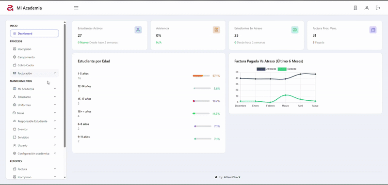

### 7.2 Modificar precio de artículo

Para modificar o agregar el precio a un artículo, siga los pasos detallados a continuación:

1. Acceda a la opción [Artículo](https://app.attendchecks.com/inventario/articulo), ubicada en *`Mantenimientos > Uniformes > Inventario > Artículo`*.

2. En el listado de artículos que se muestra, identifique el artículo que desea editar y presione el ícono con forma de lápiz que aparece al final de cada registro.

3. En el formulario que se muestra a continuación, haga clic en la pestaña *Precio Artículo*, ubicada en la parte superior.

4. En el nuevo formulario, seleccione el tipo de precio que desea agregar y luego defina el monto. Para agregar el precio al detalle, presione el botón **Agregar**. Después de completar esta acción, haga clic en **Guardar** para finalizar el proceso.

    > **Nota:** Dentro de los tipos de precio que se pueden asignar a un artículo se encuentran los siguientes:  
    > - **Precio de lista:** precio base del artículo.  
    > - **Precio de venta:** precio vigente que puede tener el artículo por un período indeterminado.  
    > - **Precio de promoción:** precio vigente que puede tener el artículo por un período determinado.

Ejemplo:

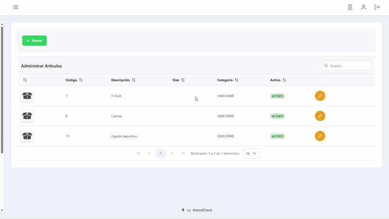

### 7.3 Compras

Para registrar una compra, siga los pasos detallados a continuación:

1. Acceda a la opción [Nueva Compra](https://app.attendchecks.com/process/compra), ubicada en *`Mantenimientos > Uniformes > Compras > Nueva Compra`*.

2. En la parte superior de la ventana, seleccione el suplidor del cual procede la compra.

3. Luego de indicar el suplidor, ingrese los detalles de la compra. Para ello, presione el botón **Agregar**. A continuación, se desplegará un formulario en el que deberá ingresar los datos del artículo, indicando el costo y la cantidad correspondiente. Para agregar el artículo al detalle, presione el botón **Guardar**.

4. Una vez agregados todos los artículos del pedido, presione el botón **Guardar** para completar la transacción.

Ejemplo:

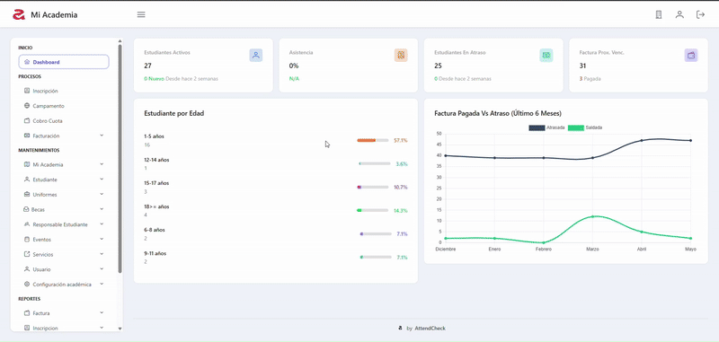

---

## 8. Eventos  

### 8.1 Crear evento pagado

Para crear un evento, siga los pasos detallados a continuación:

1. Acceda a la opción [Evento](https://app.attendchecks.com/evento), ubicada en *`Mantenimientos > Eventos > Evento`*.

2. En la ventana que se muestra, presione el botón **Nuevo**, ubicado en la parte superior.

3. En el formulario que aparece a continuación, complete los datos solicitados.

4. Para finalizar, presione el botón **Guardar** para registrar el evento.

Ejemplo:

---

## 9. Cargar datos en lote

### 9.1 Cargar lote de estudiantes

Para realizar una carga masiva de datos de estudiantes, siga los pasos detallados a continuación:

1. Acceda a la opción [Carga Masiva Estudiantes](https://app.attendchecks.com/batch/estudiante), ubicada en *`Mantenimientos > Procesamiento en lote > Estudiante`*.

2. En la ventana que se muestra, presione el botón **Nuevo**, ubicado en la parte superior.

3. En la ventana de diálogo que aparece a continuación, presione **Seleccionar** para buscar y cargar el archivo con los datos de los estudiantes.

> **Notas:** Actualmente solo se permite la carga de archivos en formato `.csv`.  
> El archivo debe tener la siguiente estructura:  
> 
> | nombre* | apellido* | sexo* | telefono*     | telefono_dos | correo_electronico | codigo_pais_nacimiento | tipo_documento | document_id   | fifa_connect_id | colegio_id |
> |---------|-----------|-------|---------------|--------------|--------------------|------------------------|----------------|---------------|-----------------|------------|
> | Juan    | Guzmán    | M     | 809-999-9999  | 809-999-9999 | email@domain.com   | 1                      | CEDULA         | 999-9999999-9 |                 |            |
>
> **Descripción de campos:**  
> - `*` Campos obligatorios.  
> - **nombre:** Nombre del estudiante.  
> - **apellido:** Apellido del estudiante.  
> - **sexo:** M o F.  
> - **telefono:** Número de contacto.  
> - **telefono_dos:** Contacto secundario.  
> - **correo_electronico:** Dirección de correo para notificaciones.  
> - **codigo_pais_nacimiento:** Por defecto: 1 (República Dominicana).  
> - **tipo_documento:** CÉDULA o PASAPORTE.  
> - **document_id:** Número del documento de identidad.  
> - **fifa_connect_id:** (opcional).  
> - **colegio_id:** (opcional).

4. Luego de cargar el archivo, los datos se mostrarán en la tabla ubicada en la parte inferior. En este punto, podrá editar o eliminar cualquier registro haciendo clic en los íconos correspondientes al final de cada fila.

5. Una vez que haya corregido o eliminado los registros necesarios, presione el botón **Guardar** para finalizar el proceso de carga.

> **Nota:** En la parte superior de la ventana se muestra un contador con la cantidad de estudiantes que presentan errores. Mientras existan errores en los registros, no será posible procesar el archivo. Para continuar, debe editar o eliminar dichos registros.

Ejemplo:

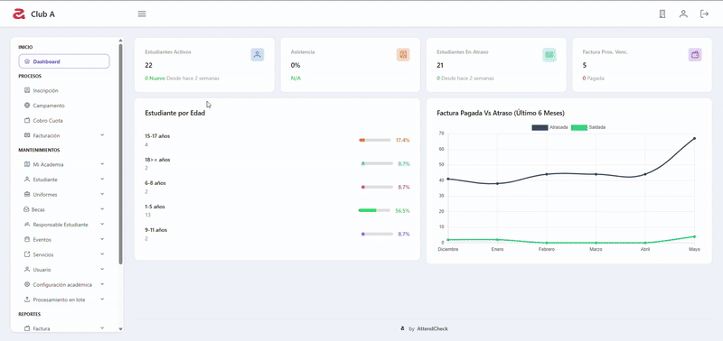

### 9.2 Cargar lote de artículos

Para realizar una carga masiva de datos de artículos, siga los pasos detallados a continuación:

1. Acceda a la opción [Carga Masiva Artículos](https://app.attendchecks.com/batch/articulo), ubicada en *`Mantenimientos > Procesamiento en lote > Artículos`*.

2. En la ventana que se muestra, presione el botón **Nuevo**, ubicado en la parte superior.

3. En la ventana de diálogo que aparece a continuación, presione **Seleccionar** para buscar y seleccionar el archivo con los datos de los artículos a cargar.

> **Notas:** Actualmente solo se permite la carga de archivos en formato `.csv`.  
> El archivo `.csv` debe tener la siguiente estructura:  
>
> | codigo_upc* | descripcion* | cantidad* | codigo_size* | excento_itbis |
> |-------------|--------------|-----------|--------------|---------------|
> | 10          | UNIFORME     | 2         | 1            | NO            |
>
> **Descripción de campos:**  
> - `*` Campos obligatorios.  
> - **codigo_upc:** Código único para identificar el artículo.  
> - **descripcion:** Descripción del artículo.  
> - **cantidad:** Número de artículos a agregar al inventario.  
> - **codigo_size:** Código correspondiente a una talla registrada en el sistema.  
> - **excento_itbis:** Indique `SI` o `NO`.

4. Luego de que los registros se hayan cargado y mostrado en la tabla, seleccione la categoría correspondiente para los artículos. Para ello, haga clic en el selector de categoría ubicado en la esquina superior derecha de la pantalla y seleccione una de las opciones disponibles.

> **Nota:** Por defecto, todos los artículos incluidos en una misma carga deben pertenecer a la misma categoría.

5. Antes de completar el proceso, es posible editar o eliminar cualquier registro directamente desde la tabla. Para ello, presione los íconos correspondientes al final de cada fila.

6. Una vez que haya revisado los datos, presione el botón **Guardar** para completar el proceso de carga.

> **Nota:** En la parte superior de la ventana se muestra un contador con la cantidad de registros con errores. Mientras existan errores, no será posible procesar el archivo. Los registros deben corregirse o eliminarse antes de continuar.

Ejemplo:

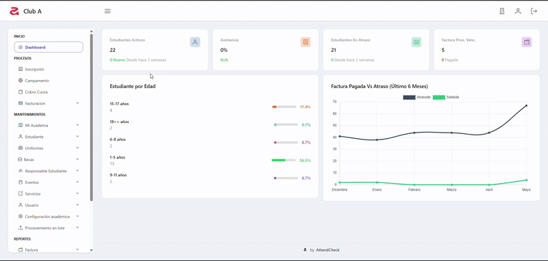

---

## Soporte

Si tienes preguntas, errores que reportar o sugerencias para mejorar la aplicación, no dudes en ponerte en contacto con el desarrollador.

**Contacto del desarrollador:**  
📧 Email: attendchecks@gmail.com  
📱 WhatsApp: +1 (829) 851-0538 o +1 (829) 642-9116  
💻 Pagina: [https://attendchecks.com](https://attendchecks.com)

Se recomienda incluir capturas de pantalla o una descripción clara del problema al momento de contactar.